# MiniSQL 小组实验报告

> 陈玮烨 张辛宁
>
> 指导老师：孙建伶

## 一、  实验目的

设计并实现一个精简型单用户 SQL 引擎(DBMS) MiniSQL，允许用户通过字符界面输入 SQL 语句实现表的建立/删除；索引的建立/删除以及表记录的插入/删除/查找。 

通过对 MiniSQL 的设计与实现，提高学生的系统编程能力，加深对数据库系统原理的理解。 

## 二、  系统需求

1.  **需求概述**
    * **数据类型**
      * 只要求支持三种基本数据类型:int，char(n)，float，其中 char(n)满足 1 ≤ n ≤ 255。
    * **表定义**
      * 一个表最多可以定义 32 个属性，各属性可以指定是否为 unique；支持 unique 属性的主键定义。
    * **索引的建立和删除**
      * 对于表的主键自动建立 B+树索引，对于声明为 unique 的属性可以通过 SQL 语句由用户指定建立/删除 B+树索引(因此，所有的 B+树索引都是单属性单值的)。
    * **查找记录**
      * 可以通过指定用 and 连接的多个条件进行查询，支持等值查询和区间查询。
    * **插入和删除记录**
      * 支持每次一条记录的插入操作;
      * 支持每次一条或多条记录的删除操作。(where 条件是范围时删除多条)
2.  **语法说明**
    * **Supported SQL statements 支持的SQL语句**
      - CREATE TABLE *table_name* (*attribute_name1* *data_type1* \[PRIMARY KEY | UNIQUE] \[, …(other create definitions)][\[PRIMARY KEY (attribute_name_PK)]);
      - CREATE INDEX *index_name* ON *table_name* (*attribute_name*);
      - INSERT INTO *table_name* VALUES (*value1*[, value2[, ….]]);
      - SELECT * FROM *table_name* [WHERE *condition1*[ AND *condition2* [ AND… ]]];
      - SELECT *attribute_name1* [, *attribute_name2* [, …...]] FROM *table_name* [WHERE *condition1*[ AND *condition2* [ AND… ]]];
      - DELETE FROM *table_name* [WHERE *condition1*[ AND *condition2* [ AND… ]]];
      - DROP TABLE *table_name*;
      - DROP INDEX *index_name* ON *table_name*;
    * **System commands 系统控制语句**
      - EXECFILE *file_name*;
      - QUIT;

## 三、  实验环境

1. Common Softwares
   * Visual Studio Code
   * CMake 3.14
   * GitHub Desktop (The repository is privately owned on GitHub)
2. Windows 10 version 1809
   * Visual Studio 2017 
3. macOS 10.14.4
   * CLion 2019.1

 

## 四、  系统设计

### 1. 分工情况

本实验由计科18级的张辛宁以及地理信息科学16级的陈玮烨完成。

#### 张辛宁

主要负责Catalog Manager, Index Manage和Buffer Manager的编写，并大力支持了上层的API的构建。 

#### 陈玮烨

主要负责Interpreter, API, Catalog Maneger和Record Manager的编写。

**两人共同设计通用细节的构建，并合力解决项目中出现的问题。**


### 2. Interpreter

* **程序执行流程图**

  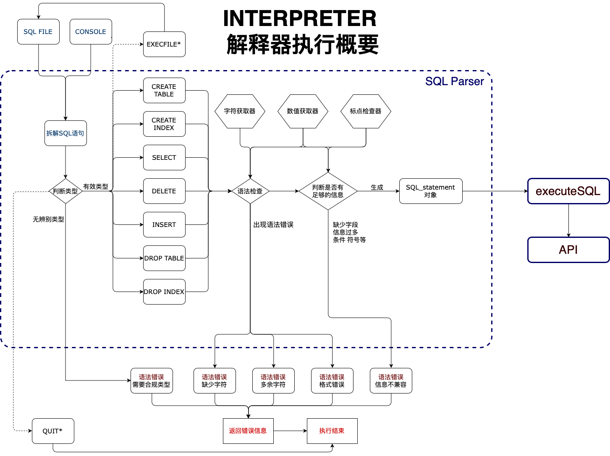

* **主要数据结构**

  * **`Attribute`字段类**

    * 该类定义了一个字段的所需要的数据结构。

      * 字段类型定义为`AttributeType`

        ```c++
        enum class KTP
        {
        	UNDEF = 0,
        	INT,
        	FLOAT,
        	STRING
        };
        #define AttributeType KTP
        ```

      * 字段类还包含了以下属性

        ```cpp
        AttributeType type;         // Data type of the current table attribute
        int VARCHAR_LEN = 0;        // If the attribute is varchar, this field is applicable.
        string name;                // Name of the attribute
        bool primaryKey = false;    // if the attribute is primary key
        bool unique = false;        // if the attribute is unique
        bool hasindex = false;
        string indexName = "";
        ```
      
    * 字段类是整个系统中的一个重要的数据结构，Record Manager, Catalog Manager的构建也依赖于该数据结构。

    * 系统执行CREATE TABLE语句创建的新的表格的字段信息首先会被处理成`vector<Attribute>`结构，之后交由Catalog Manager生成表格并持久化。

    * 系统执行INSERT语句会根据储存好的或是从硬盘中读取的字段列表（`vector<Attribute>`结构）来判断插入的值是否合法。

    * 系统执行SELECT, DELETE, CREATE INDEX, DROP INDEX, DROP TABLE都需要参照该结构表现的字段列表。

  * **`SQL_Statement​`SQL语句类**

    * 该类数据结构定义了一个SQL语句分解后的成分。包括

      * **语句类别 `statementType`类**

        规定了支持的语句类型

        ```cpp
        enum class statementType {
            SELECT,
            INSERT,
            CREATETABLE,
            CREATEINDEX,
            DROPTABLE,
            DROPINDEX,
            DELETE,
            QUIT,
            EXECFILE
        };
        ```

        每一个有效的SQL语句都能被赋予一个合适的语句类别，其中有两个例外：QUIT以及EXECFILE在我们的系统中同样被处理成SQL语句，只是不会涉及到对数据的查询操作。

      * **键值对 `KeyValueTuple`类 和 带类型的值`ValueWithType`结构**

        * 键值对`KeyValueTuple`对象规定了记录"字段-值"的数据结构。
      
        * 其中保存数据使用 `ValueWithType` 对象，其定义为
      
          ```cpp
          typedef struct Value {
              int intValue;        // Data for attributes of int
              float floatValue;    // Data for attributes of float
              char charValue[256]; // Data for attributes of varchar
              int charValueLen;    // Length of varchar
          } Value;
          typedef struct ValueWithType {
              Value value;
            AttributeType type;
          } ValueWithType;
          ```
        
        `ValueWithType`结构用于INSERT语句。通常INSERT语句会包含多个`ValueWithType`结构，在我们的系统中使用vector容器包装。
      
      * **条件对象 `Condition` 类**
      
        * `Condition` 是由 `KeyValueTuple`继承而来的子类，添加属性 `operatorType opType`后形成SELECT, DELETE语句中的条件对象。
      
        * 条件类型`operatorType`是一个枚举类，其规定了系统支持的条件类型。
      
          ```cpp
          enum class operatorType{
              UNDEFINED,
              EQ,     // = Equal to
              GT,     // > Greater than
              LT,     // < Less than
              GTE,    // ≥ Greater than or equal to
              LTE,    // ≤ Less than or equal to
              NEQ     // ≠ Not equal to
          };
          ```
      
      * **其他`SQL_statement`类所需要的必要信息**
      
        ```cpp
        string tableName;		// 表名
        string indexName;		// 需要插入/删除的索引名
      	vector<string> * selectedAttrList;	
        // SELECT需要输出的字段 和 CREATE INDEX需要建立索引的字段
        ```
        

  * **语法错误`SyntaxError`类**

    * 我们定义语法错误具有以下类型

      ```cpp
      enum class SyntaxErrorType
      {
          Expecting,		   // 缺少符号
          Unexpected,		// 多出符号
          Fatal,				// 严重错误
          Undefined
      };
      ```

    * 该类规定了语法错误的信息，包括

      ```cpp
      SyntaxErrorType type;		// 语法错误类型
      string SQL;					   // 出现错误的SQL语句字符串
      string::size_type pos;	   // 出现的语法错误在字符串中的位置
      string notice;					// 消息
      ```

    * 该类还规定了如何输出错误信息的方法等。

* **如何检测SQL是否有错误**

  * 因为SQL语句具有固有的范式，在Interpreter层，我们暂时不考虑数据库内有什么数据，而仅仅判断SQL语句单独意思本身是否存在语法错误。

  * 按照顺序读取SQL语句。我们以SQL语句中的CREATE TABLE为例，用伪代码来说明

    ```c
    if (checkStatementType() == statementType::CREATETABLE)
      UnexpectingPunctuation()					// 此处不能有其他符号出现
      if (!getTableName())							// 获取表名
        throw SyntaxError('table_name')	   // 缺少表名
      UnexpectingPunctuation()					// 此处不能有其他符号出现
      if (!checkLeftParenthsis())				// 检查左括号
        throw SyntaxError('(')					// 缺少左括号
      UnexpectingPunctuation()					// 此处不能有其他符号出现
     	if (!getAttributeSpecification())	   // 获取字段列表
        throw SyntaxError('....')				// 在获取字段列表的函数中也有语法检查机制
    ......
    ......
    ```

  * 在检查的过程中，记录检查机制的游标。当发生错误时，连同游标返回给用户。这样用户即可发现错误。
  
  * 同样的方法，我们将语法检查机制嵌合在其他类型的语句中，获得了良好的效果。


### 3. API

* **功能描述**

  * API 模块是整个系统的核心，其主要功能为提供执行 SQL 语句的接口，供 Interpreter 层调用。该接口以 Interpreter 层解释生成的命令内部表示为输入，根据 Catalog Manager 提供的信息确定执行规则，并调用 Record Manager、Index Manager 和 Catalog Manager 提供的相应接口进行执行，最后返回执行结果给 Interpreter 模块。

* **主要数据结构**

  * API的功能都被集成到了API类中。在我们的系统设计中，API的调用嵌入在Interpreter中的`executeSQL`上，将SQL_statement类对象转化成API的指令。

  * API主要实现了以下功能：

   ```cpp
  bool CreateTable (string tblName, vector<Attribute>* attributes);
  bool CreateIndex (string tblName, string idxName, vector<string>* attrList);
  bool Select (string tblName, vector<Condition>* conditions, vector<string>* selectedAttrList);
  bool InsertAll (string tblName, vector<ValueWithType> * values);
  bool InsertWithAttr (string tblName, vector<KeyValueTuple>* keyValues);
  bool DropTable (string tblName);
  bool DropIndex (string tblName, string idxName);
  bool Delete (string tblName, vector<Condition>* conditions);
   ```

* 说明设计的类

  * 指令运行的计时器模块在Interpreter中完成——在解析完指令后，调取API前开始计时，API内的程序执行完毕后停止计时。

  * API具体的实现依赖下文需要描述的 Catalog Manager, Record Manager, Index Manager提供的功能。具体的实现在见[第五节系统实现分析](# 五、  系统实现分析及运行截图)中说明。
  
    

### 4. Catalog Manager

* **功能描述**

  * Catalog Manager 负责管理数据库的所有模式信息，包括:
    1. 数据库中所有表的定义信息，包括表的名称、表中字段(列)数、主键、定义在该表上的索引。
    2. 表中每个字段的定义信息，包括字段类型、是否唯一等。
    3. 数据库中所有索引的定义，包括所属表、索引建立在那个字段上等。
  * Catalog Manager 还必需提供访问及操作上述信息的接口，供 Interpreter 和 API 模块使用。

* **主要数据结构**

  * **数据模式信息`Catalog`类**

    ```cpp
    class Catalog {
    	string tablename;				// 用于保存数据表名称
    	int table_block_cnt, attributes_cnt;	// 保存占用的Block数量，字段数量
    	vector<Attribute>* attributes;				// 表示字段信息
    	int usage;							// 最后一个block所占用的记录数
    	void Build();						// 建立一个新的数据信息模式对象
    	void Read();						// 从磁盘中读取并声称一个数据信息模式对象
    	void Write();						// 将内存哪的数据信息模式对象写入磁盘中
    };
    ```

    * Catalog Manager需要管理一些数据模式信息对象，一个表格对应的是一个数据模式信息对象。Catalog类对象存在于内存中，储存着数据表的所有元数据信息，包括名称、字段信息、使用的储存块数等。数据的大小和数量信息由Record Manager来维护。
    * 字段信息在Create Table的命令执行后生成。我们在Interpreter中已经实现了字段数据结构的创建。字段的数据结构的描述详见在[Interpreter](# 2. Interpreter)的说明中描述的`Attribute`字段类。
    * Catalog 对象会在每次系统关闭后写入到硬盘中，在系统开启时按照需求读取到内存里。

  * **数据模式信息管理器 `Catalog Manager`类**

    * 数据模式信息管理器主要负责在管理在内存和在磁盘上的数据信息模式数据。在内存中，我们将所有的`Catalog`类对象都保存到一个map结构中，并用其代表的表名标记起来。

      ```cpp
      map<string, Catalog*> catalogMap;
      ```

    * 而数据模式信息管理器的主要功能就是维护这个map中所有的内容。其对外提供了以下数据接口：

      * 查询关系模式是否存在
        * 获取表示上述关系模式信息的`Catalog`对象
      * 查询关系模式中是否存在指定名称的字段
        * 获取表示上述字段的`Attribute`对象
      * 查询关系模式中是否存在索引
        * 查询关系模式中是否存在指定名称的索引
        * 查询关系模式中的指定字段上是否存在索引
        * 获取表示上述索引的`Index`对象
      * 添加数据模式信息`Catalog`对象
      * 删除数据模式信息`Catalog`对象
      * 将`catalogMap`中所有的`Catalog`对象都保存到磁盘中。
      * 读取磁盘内的的`Catalog`对象。

* **和其他模块的关系**

  * 在 Catalog Manager 的实现中，我们依赖 Buffer Manager 来读取和交换信息。
  * 在 API 中，我们需要 Catalog Manager 提供对应的数据模式的元数据信息。


### 5. Record Manager

* **功能描述**
  * Record Manager 负责管理记录表中数据的数据文件。主要功能为实现数据文件的创建与删除(由表的定义与删除引起)、记录的插入、删除与查找操作，并对外提供相应的接口。其中记录的查找操作要求能够支持不带条件的查找和带一个条件的查找(包括等值查找、不等值查找和区间查找)。 
  * 数据文件由一个或多个数据块组成，块大小应与缓冲区块大小相同。一个块中包含一条至多条记录，为简单起见，只要求支持定长记录的存储，且不要求支持记录的跨块存储。 
  
* **主要数据结构**
  
  * **单条记录 结构 `Record`**
  
    * 单条记录又键值对`KeyValueTuple`的向量来表示
  
      ```cpp
      typedef vector<KeyValueTuple> Record;
      ```
  
      每个向量的元素都是记录中的一个字段名称和其对应的值
  
    * 在查询的解读过程中，通过键值对查询能够获得对应的值的信息
  
    * 需要注意的是，这只是数据在读入内存后的便捷处理的结构。数据在内存和硬盘的储存结构依然是用BLOCK和预设的间隔来划分。
  
  * **记录信息类 `Records`**
  
    * 该类的对象主要是用于表示一个数据模式下的数据的记录级别的信息，包括一条记录的大小、每个块能管理的记录的数量等。
    * 该类还提供了一些成员方法，例如插入数据，获取单条记录等
      * **插入记录方法`insertRecord`**
        * 参数：单条记录结构`Record`
        * 流程
          * 查询空余的Block以及对应的offset
          * 获取对应的表格的数据模式信息`Catalog`类对象
          * 按照字段表的信息按顺序向Block内添加记录的信息
          * 如果字段上有索引，还需要将数值插入到索引上
          * 成功返回`true`，反之`false`
        * *删除记录方法 `deleteRecord`实现原理类似*
      * **获取单条记录`retrieveRecord`**
        * 参数：记录序列号 / 索引指针 / 块+偏移量组合
        * 流程
          - 定位记录在磁盘或内存中的位置
          - 获取对应的表格的数据模式信息`Catalog`类对象
          - 按照字段表的信息按顺序生成`Record`对象并返回
  
  * **记录信息管理器类 `RecordManager`**
  
    * 管理器类在全局只生成一个实例，用于管理记录信息`Record`类的对象的加载、生成和删除等。其将所有的`Records`保存在一个map内，按需获取。
    * 其提供若干成员方法，包括生成记录信息对象、加载记录信息对象、删除记录信息对象、获取记录信息对象等。
      * **生成记录信息对象`createRecords`**
        * 参数：数据模式的名称`tableName`
        * 流程
          * 生成一个新的`Records`对象并用`tableName`初始化这个对象。
          * 生成一个数据存储文件。
          * 将第一步生成的对象加入到map里。
      * **加载记录信息对象`loadRecords`**
        - 参数：数据模式的名称`tableName`
        - 流程
          - 生成一个新的`Records`对象并用`tableName`初始化这个对象。
          - 将上一步生成的对象加入到map里。
      * **删除记录信息对象`deleteRecords`**
        - 参数：数据模式的名称`tableName`
        - 流程
          - 从map中获取这个对应的记录信息对象
          - 删除所有的记录——在内存和磁盘上
  
* **和其他模块的依赖关系**

  * 在Record Manager中，需要Catalog Manager提供数据模式的信息，同样在数据获取上，采用了Buffer Manager提供的API，以块的形式获取数据。

 

### 6. Index Manager

- * **功能描述**

    - Index Manager负责B+树索引的实现，实现B+树的创建和删除（由索引的定义与删除引起）、等值查找、插入键值、删除键值等操作，并对外提供相应的接口。
    - B+树中节点大小应与缓冲区的块大小相同，B+树的叉数由节点大小与索引键大小计算得到。
    - 关于叉数的计算，其叉数 = (节点大小 - B+树节点元数据占用空间) / (单条记录大小)

  * **主要数据结构**

    - 采取了在磁盘中建立B+树的方法，维护索引信息，中间要用到一个栈，其基本实现过程原理如下：
    - 在IndexManager中，如果读取一个不存在的文件则会报错。
    - 首先，根据B+树的header，以及字段长度，我们可以计算出B+树的叉数。
    - 进程刚启动时，不同于BufferManager，对于IndexManager而言，它的存储结构，也就是B+树，每次都会直接调用BufferManager读取磁盘中的数据（如果这个数据已经在Buffer里，则返回Buffer的内容）。
    - 关键的一步是如何通过磁盘读取到索引内容，这里用到了Catalog作为描述索引的metadata的管理，Index类中，关于Catalog的指针q，就是用来描述该索引metadata的指针，它存储了关于index的元数据，会获取当前B+树的节点数，索引的数据类型，索引名字【见CatalogManager部分】。
    - **对于查询：**
      - 由于在设计存储结构时，将根节点始终放在了第0块的位置，这样方便之后的操作。
      - 通过Catalog读取元数据后，调用BufferManager去读取根节点所在块的位置后，就获取到了根节点的信息。
      - 那么假如想要获取一个KEY(记做CURRENT_KEY)在B+树所在的叶子节点：
        - 假设当前在非叶子节点x处，那么根据节点x的存储结构，可以读取出K个KEY以及K+1个POINTER，也就能获取到CURRENT_KEY对应在K个KEY里面所在的排名，获取排名后就能得到POINTER的值，也就是子节点在磁盘中的存放位置，这样可以再继续通过BufferManager和POINTER的信息，从磁盘中读取到这个儿子节点的信息。
        - 假设当前在叶子节点，直接返回这个叶子节点即可。
      - 通过这样一番思路，也就意味着，如果能知道索引的名字，就能通过Catalog获取到索引的metadata，从而读取索引文件，读取索引文件的根节点的位置，从而能在磁盘中的B+tree进行查找。
      - 上述就是查找过程的原理。
    - **对于插入：**
      - 接下来叙述插入记录的原理：
      - 首先，按上述查找的方法，找到这个KEY所对应到的节点位置，由于索引是Unique的，故如果找到了这个KEY在叶子中出现，则需要抛出一个异常。
      - 之后，在节点中的vector里加入这条记录，并新增这条记录在表文件中的位置。
      - 由于块的大小并不大，所以可以**考虑压位存储在文件中的位置**：由于用block_id(表格所在块的标号), offset(块内偏移量)可以唯一标识一个记录在表格文件中的位置，而块的大小只有4K即偏移量的最大值只有4096，处于节省空间，可以考虑用一个int变量，pos = 10000*block_id+offset来记录这个位置，在之后查询得到指针后再进行解压缩。~~（虽然只省了4B）~~ 
      - 接下来就去判断当前节点是否满足B+树性质，如果满足则不变，否则就执行分裂操作，并新增一个子树最小值到父亲节点中。随后对这个节点的父亲也进行判断。
      - 而当这个节点是根的时候（根的容量超过了限制），则要把根分裂两个节点，并新建一个节点作为根，并且把新增节点与第0块位置进行交换（保证根的位置永远在0处）。
    - **对于删除：**
      - 先来讨论单点删除，首先按照之前的思路遍历到叶子节点，如果这时叶子节点满足要求，则直接返回，这里涉及到了理论和实际的问题，当一个元素被删除时，理论上相邻两个节点如果加起来刚好满足了B+树的上限，或者当前节点可以和相邻节点去借一个元素过来，那么都会对相邻节点进行操作，但是同样地，在仅仅是一个元素这个东西上面，就浪费了一次transfer的时间和一次寻道的时间。
      - 不妨看下面的例子，左侧为相邻的节点。那么如果隔一段时间（LRU替换掉当前位置）去删除一次右侧节点的一个元素，M次后，就会导致额外的M次的开销。
      - [2M elements(full)] --------- [M elements]
      - 这样的话，对于单点删除，只需要在当前节点为空的时候，向上把父亲节点所对应的KEY删掉即可，这样所带来的代价，按上图的例子，对于M次的删除，每次都要额外在父亲节点处多遍历一个元素，但是，父亲节点中遍历元素的时候，是已经读进内存里了，所以M次在内存里多遍历一个元素的代价，实际开销远小于M次的transfer时间加上M次寻道时间。
      - 对于区间删除，也可以采取如此操作，但区间操作的基础，是先查找到最底层节点，然后进行链表操作，此时链表表面看起来连续，实际上相邻两个节点存储的位置在索引文件中是不连续的。
      - **其实B+树在区间查询的表现上并不是太好，性能的分析可以见下文。**
    - **时间分析：**
      - 由于B+树的插入，删除，查询这三大操作复杂度都是$O(log_kN)$的级别，对于非区间询问，我们可以大大加快查询速度，但对于极端的区间类操作（比如覆盖全集的区间），此时表面上看和按顺序遍历没有复杂度的区别，实际上多了$\lfloor N/BLOCK\_SIZE\rfloor$大小的磁道定位的时间，此时索引查询并不优。
      - 尝试运行查询10000条记录（student2的验收样例）的完全区间查询之后，建立索引后达到了328680个单位时间，不建立索引只需要141481个单位时间。**也就是说，对于长度很大的区间查询，直接遍历整个表才是最优的选择。**
    - **细节分析：**
      - 怎么在插入的时候获取父亲所在的节点信息？
      - 错误做法：
        - **每个节点处记录父亲的位置**，那么在插入操作的分裂阶段以及在删除操作的时候，常数都会暴增。理由：比如在插入的过程中，如果要进行分裂，那么一半的子节点的父亲信息将会受到更改，虽然在内存中是可以保证这个复杂度的，但由于要写出的子节点都是在磁盘中的，也就意味着，$\lfloor \frac {BLOCK\_SIZE} {2*RECORD\_SIZE}\rfloor$ 个块会被buffer写入再写出，多了额外的$\lfloor \frac {BLOCK\_SIZE} {2*RECORD\_SIZE}\rfloor$次磁盘寻道操作以及transfer操作，是**非常不可取的**。
      - 正确做法：
        - 在插入删除操作时，维护一个对节点地址(指的是所在的块标号)的栈，存储之前所加入的节点地址信息，那么在到达叶子节点后，通过回溯这个栈的信息，就能重新读取之前需要修改的父亲节点，也就是说，父亲节点在B+树上的信息存储是冗余的，并且也会带来时间上的很大的开销。

    

  * **说明设计的类(如果有)，以及类间关系**

     声明了一个名为Index的类，其主体部分以及类间函数声明如下：

- ```c++
  class Index
  {
  public:
  	Index(string tablename, string colname, string indexname, KTP ktp, int len); // get name from <table, col>
  	string tablename, colname, index_name;
  	KTP ktp;
  	int len;
  	// functions
  
  	Node ReadNode(BP_POINTER pt); //get index file
  	Node NewNode();
  	Catalog_Index* q;
  	Node GetMinLeaf(Node x); // 用于获取最小的叶子节点
  };
  void Drop_Index(string tablename, string attributename);
  Index*  Get_Index(string tablename, string colname, string index, KTP ktp, int len);
  Index* Create_Index(string tablename, string colname, string index, KTP ktp, int len);
  ```

- ​	其中，Node是一个类，也就是Index中每个的节点的类型，其内部构成如下：

  ```c++
  struct Node 
  {
      BPHEADER header; //记录每个节点的元数据
      vector<BPKEY> sons; // 记录B+树节点的儿子信息
      BLOCKS *msg; //指向一个BufferManager中的块
      Node()
      {
          header = BPHEADER();
          sons.clear();
          msg = NULL;
      }
      Node(const Node& a)
      {
          header = a.header;
          for (auto i : a.sons) sons.push_back(i);
          msg = a.msg;
      }
  }；
  ```

- 其中，header为节点的元数据信息，它记录了：

  - 节点的下一个兄弟
  - 节点的数据类型
  - 节点的单个字段长度
  - 节点的当前字段数
  - 当前节点是否是叶子节点

- header的实现细节和BufferManager相联系，其读取和存储和基本类型如出一辙，故不再谈。

- BPKEY为一个类，是B+树中一个键值和一个地址的封装。

- ```c++
  typedef int BP_POINTER;
  struct BPKEY
  {
      KEY key;
      BP_POINTER pt; //指向文件中下标
  };
  ```

- KEY是一个把string,int,float三种数据包装起来的整体，由于想避免对于多种数据在比较时的不方便，可以把它封装成一个类，并重载比较运算符，KEY这个类的具体实现细节在minisql.h中可以找到，其做法是在内部记录数据的类型以及字段的长度，并重载几种比较的运算符。

- 类与类之间关系如下：

  


### 7. Buffer Manager

* **功能描述**

  * Buffer Manager负责缓冲区的管理，主要功能有：
    * 根据需要，读取指定的数据到系统缓冲区或将缓冲区中的数据写出到文件
    * 采用LRU的缓冲区的替换算法，当缓冲区满时选择合适的页进行替换
    * 记录缓冲区中各页的状态，如是否被修改过等
    * 提供缓冲区页的pin功能，及锁定缓冲区的页，不允许替换出去
  * 为提高磁盘I/O操作的效率，缓冲区与文件系统交互的单位是块，块的大小为文件系统与磁盘交互单位的整数倍(定为4KB)。

  

* **主要数据结构**

  * 采取了**数组和map**来实现整个模块，下面从BufferManager的整个流程上说明一下这两个数据结构是如何使用的：【注：所用类及函数声明见下文】
  * 进程刚启动时，由于内存中还没有数据，BufferManager会从磁盘中不断收到外界发来的文件读取或者文件写的语句，即执行ReadBlocks语句，以及BLOCKS类内部数据的写入写出，在从磁盘中读入数据时，维护一个**map**来反映BufferManager中是否存在某个文件中的某一块的数据。
    * 举例：如果从磁盘中读写了一个文件名为"FILE"的第N块数据，则会在这个map中加入对这一块的指针。
  * 在程序运行过程中，可能会重复地访问某个文件某个块多次，如果这个块还没有被写出(即还在上述的**map**中)，则会用**map**返回这个块的指针。
  * 用**map**而不采取数组/链表的原因是因为map对于维护BufferManager的效率比这两者要高，其理论复杂度为$O(log_2n)$。
  * 当BufferManager被写满后，就要利用LRU算法进行块的替换，此时采取一个改进后的CLOCK算法：
    * 首先忽略所有被固定在BufferManager中的块。
    * 对于所有的块，优先写出没有被修改的同时，距离上次使用的时间最长的块。
    * 如果在步骤1中没有找到满足要求的块，则在被修改的块中找出一个距离上次使用时间最长的块进行写出。
  * 这里可以采取两种方式进行维护，一种是采取堆结构，一种直接采取**数组**进行替换。
  * 理论看来，堆的结构会复杂度更优一点，但实际上由于常数过大，导致不如数组，于是最终选取了**数组**做LRU。
  * 对于每次替换过程，当一个块被替换掉了，就需要写出到磁盘里，此时可以调用BLOCKS内部的函数进行写出。
  * 每次写出后，把块上带的标记(busy(LRU标记)/dirty(是否被修改过))改为初始状态。
  * 在MINISQL整个程序结束时，统计BufferManager中还没有被写出的块，每个块进行强制写出。

  

* 说明设计的类(如果有)，以及类间关系

 声明了一个名为BufferManager的类，其主体部分声明如下：

```c++
class BufferManager {
public:
	
	BufferManager() { blocks = new BLOCKS[BLOCK_CNT]; }
	~BufferManager(){ delete[] blocks; }
	BLOCKS& ReadBlocks(string &filename, int block_id); //读取文件中的一块到内存中
	BLOCKS& GetFreeBufferPrefer(); // 获取一个空块
	void FlushAllBlocks();  //将Buffer内的所有块写出
	BLOCKS& GET_LRU(int p); 
	void DeleteFile(string &filename); //删除某个Buffer中关于某个文件的内容
private:
	BLOCKS *blocks; //存储整个buffer pool
};
```


其中，BLOCKS是一个类，也就是BufferManager每次分配的每个块的大小，一个BufferManager有BLOCK_CNT个块，BLOCKS类内有一些函数可供调用，它是BufferManager与磁盘之间交换数据的基本单位，其内部构成如下：

```c++
class BLOCKS
{
public:
	BLOCKS() : data(NULL), pin_tag(false), dirty_tag(false), busy_tag(false), file_name(""), block_id(-1) // 块的信息 在LRU中是否为pin状态 是否被修改过 LRU标记 块的文件名 块在文件中的位置
	{
		data = new BYTE[BLOCK_SIZE + 1];
		for (int i = 0; i <= BLOCK_SIZE; ++ i) data[i] = 0;
	};
	~BLOCKS() { delete[] data; }
    //... some other functions
    string file_name;
	unsigned block_id;
	BYTE *data; //用于数据交换
};
```

类间函数描述：

```c++
BLOCKS& ReadBlocks(string &filename, int block_id); //读取文件中的一块到内存中
```

​	这是用来返回一个给外部可以访问的块，调用整个函数就可以得到文件中的某一段连续的字节，在实现时，首先判断是否在上述的map中（即是否已经在内存中），如果没有在内存中，则进行读入，并更新map里的指针。


```c++
BLOCKS& GetFreeBufferPrefer(); // 获取一个空块
BLOCKS& GET_LRU(int p);
```

​	用LRU算法获取某个空块，其中GET_LRU函数的作用是把第p块强制写出，并把map中原来指向p的指针删除。

### 8. DB Files

* **数据模式信息（表格）存储文件格式说明**

  * 这类文件负责储存所有表格的原数据，以`.catalog`为扩展名；另加一个文件记录所有的数据模式的目录，命名为`CatalogList`.
  * **数据模式目录`CatalogList`**
    * 数据由CatalogManager管理，按线性保存了所有的数据模式（表格）的名字
    * 作为系统恢复时读取目录的凭据
  * **数据模式信息文件`*.catalog`**
    * 文件名为`[tableName].catalog`
    * 以二进制的方法顺次保存了数据模式名称，数据块数量和使用情况，以及字段信息

* **数据记录信息储存文件格式说明**

  * **数据记录信息文件`*.record*`**

    * 该文件按照`Catalog`中规定的字段列表中的顺序储存了数据记录，按照线性存储数据。

    * 每一条记录在最前面包含了一个bit的占位符，用于保存该位置及之后的单记录长度的数据内是否有数据。保存有效的数据记为1，删除或不存在则为0。对于删除的记录位置，由链表串成。

    * 示例存储格式

      * 要描述一个模式为 int, float, varchar(10), int 的数据表格

      * 每个记录的长度为 $ l = 1+sizeof(int) + sizeof(float) + 10 \times sizeof(char) + sizeof(int)  $

      * | 起始位置 ($k \in \N \  \and \ k < 记录数量$ )                | 长度                      | 内容                        |
        | ------------------------------------------------------------ | ------------------------- | --------------------------- |
        | $kl$                                                         | $1$                       | 数据存在与否标记符          |
        | $kl + 1$                                                     | $sizeof(int)$             | 第一个INT类型的数据         |
        | $kl + 1 + sizeof(int)$                                       | $sizeof(float)$           | 第一个FLOAT类型的数据       |
        | $kl + 1 + sizeof(int)+sizeof(float)$                         | $10 \times  sizeof(char)$ | 第一个VARCHAR(10)类型的数据 |
        | $kl + 1 + sizeof(int)+sizeof(float)+10 \times  sizeof(char)$ | $sizeof(int)$             | 第二个INT类型的数据         |

* **索引记录信息储存文件格式说明**

  *  **索引记录信息文件`*.index`**
  
     - 该文件按照`Catalog`中规定的字段列表中的顺序储存了数据记录，按块存储数据，第$0$块存储根的数据。
  
     - 示例存储格式
  
       - 描述一个模式为string的B+树节点
  
       - 每个块的大小为 $buffer$中的大小
  
       - | 起始位置 ($k \in \N \  \and \ k < 节点个数$ ) | 长度             | 内容             |
         | --------------------------------------------- | ---------------- | ---------------- |
         | $kl$                                          | $sizeof(header)$ | B+树的元数据     |
         | $kl + sizeof(header)$                         | $sizeof(str)$    | 第一个儿子信息   |
         | $kl + sizeof(header) + i*strlen(str)$         | $sizeof(str)$    | 第$i$个儿子信息  |
         | $kl + sizeof(header)+(p-1)*sizeof(str)$       | $sizeof(str)$    | 最后一个儿子信息 |
     
  

## 五、  系统实现分析及运行截图

本节主要的驱动构件是API，而API的实现依赖于下层的Catalog Manager, Record Manager, Index Manager以及Buffer Manager.

<div style='color:red'>需要注意的是运行结果图中的运行时间的单位是基于一个单位的时间是1/1000秒（millisecond）来编写的，但实际上时间的单位是1/1000000秒。这个单位实际上应当与系统平台相关。</div>
所以运行时间的单位暂时不必纠结，只需要了解相对的时间大小的量。

### 1. 创建表语句

示例语句：

```sql
create table student2(
   id int,
   name char(12) unique,
   score float,
   primary key(id) 
);
```

* 针对该类语句，解析、语法检查和执行都部署完毕

  * 语法检查：常规错误可以检查和提示，对于primary key不正确指定的，予以报错。对不存在合适的数据类型的，予以报错。

  * 如果出现重复名称的数据模式，则不允许继续执行，并返回错误信息。

    > <div style='color:red'>Table [ tblName ] already exists.</div>

  * 如果没有成功创建数据模式信息`Catalog`或者是写入不成功等错误，则不允许继续执行，并返回错误信息。

    > <div style='color:red'>Catalog was not created.</div>

  * 如果没有指定Primary Key的信息，则不允许继续执行，并返回错误信息。

    > <div style='color:red'>No primary key specified in the table.</div>

  * 如果执行成功，则返回执行的时间信息。

* **执行该SQL所需的模块以及程序执行流程**

  * 该命令涉及系统的所有模块。
  * 解释器Interpreter获取SQL语句，解读后调取API中的`CreateTable`方法。
  * `CreateTable`方法调用了Catalog Manager检查数据模式是否重名。
  * 检查成功后添加`Catalog`对象和利用Record Manager创建`Records`对象
    * 创建过程中如果有索引的，添加索引。

* **运行结果截图**

  * 错误示范1：数据模式重名

    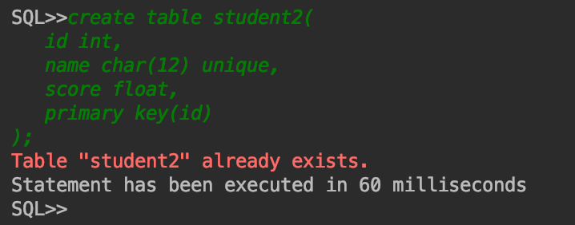

  * 错误示范2：未指定主键等

    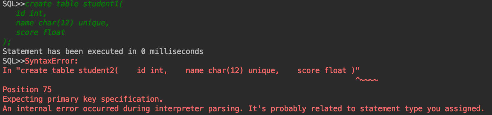

    (注：图中没有Fatal Error，报错都已经被处理好，在Terminal中执行会返回正确的格式，但CLion IDE的console输出存在顺序错乱的问题，下同，不予重复说明)

  * 错误示例3：语法错误等

    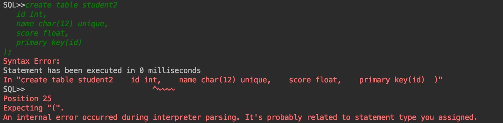

  * 正确示例

    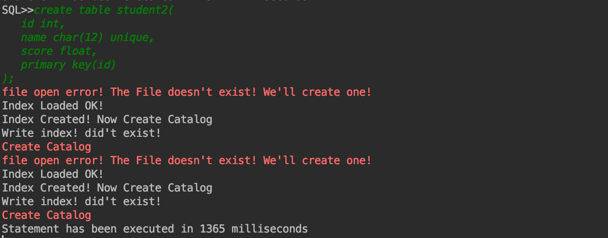


### 2. 删除表语句

示例语句：

```sql
drop table student2;
```

- 针对该类语句，解析、语法检查和执行都部署完毕

  - 提示包括但不限于下述的例子。

  - 如果出现不存在数据模式名称，则不允许继续执行，并返回错误信息。

    > <div style='color:red'>Table [tblName] doesn't exist.</div>

  - 如果数据模式信息删除出现了问题，则不允许继续执行，并返回错误信息。

    > <div style='color:red'>Cannot delete the catalog of the table [ tblName ].</div>

  - 如果执行成功，则返回执行的时间信息。

- **执行该SQL所需的模块以及程序执行流程**

  - 该命令涉及系统的所有模块。
  - 解释器Interpreter获取SQL语句，解读后调取API中的`DropTable`方法。
  - `DropTable`方法调用了Catalog Manager检查数据模式是否存在。
  - 检查成功后，获取对应的数据信息模式`Catalog`对象，按照字段信息，逐一删去对应的索引。
  - 获取对应的数据记录信息`Records`类对象，删除数据内的所有的记录
    - 删除该对象
  - 删除对应的数据信息模式`Catalog`对象。

- **运行结果截图**

  - 错误示例：删除不存在的数据表

    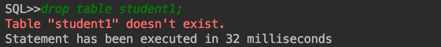

  - 正确示例

    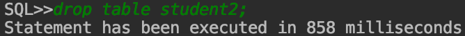

 

### 3. 创建索引语句

示例语句：

```sql
create index sidx on student2 ( name );
```

- 针对该类语句，解析、语法检查和执行都部署完毕

  - 提示包括但不限于下述的例子。

  - 如果出现不存在数据模式名称，则不允许继续执行，并返回错误信息。

    > <div style='color:red'>Table [tblName] doesn't exist.</div>

  - 如果对应的数据模式不存在指定的字段，则不允许继续执行，并返回错误信息。

    > <div style='color:red'>The attribute specified doesn't exists.</div>

  - 如果对应的数据模式存在重名的索引，则不允许继续执行，并返回错误信息。

    > <div style='color:red'>The table [tblName] already has an index named [idxName].</div>

  - 如果执行成功，则返回执行的时间信息。

- **执行该SQL所需的模块以及程序执行流程**
  - 该命令涉及系统的所有模块。
  - 解释器Interpreter获取SQL语句，解读后调取API中的`CreateIndex`方法。
  - `CreateIndex`方法调用了Catalog Manager检查数据模式以及对应的字段是否存在。
  - 检查成功后，获取对应的数据信息模式`Catalog`对象，检查对应的字段是否有索引或者是是否有重名的字段。
  - 借助Index Manager模块，创建索引对象。
  - 从Record Manager处获取所有的记录并逐一插入到索引中。
- 运行结果截图
  
  - 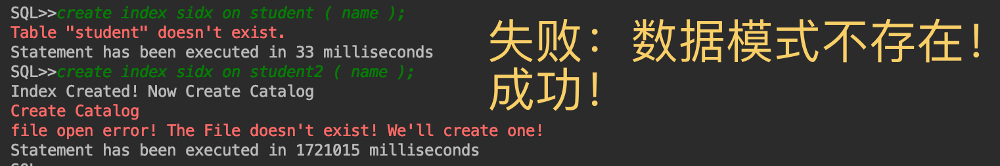


### 4. 删除索引语句

示例语句：

```sql
drop index sidx on student2;
```

- 针对该类语句，解析、语法检查和执行都部署完毕

  - 提示包括但不限于下述的例子。

  - 如果出现不存在数据模式名称，则不允许继续执行，并返回错误信息。

    > <div style='color:red'>Table [tblName] doesn't exist.</div>

  - 如果对应的数据模式不存在对应名字的索引，则不允许继续执行，并返回错误信息。

    > <div style='color:red'>Index [idxName] on table [tblName] doesn't exist.</div>

  - 如果执行成功，则返回执行的时间信息。

- **执行该SQL所需的模块以及程序执行流程**

  - 该命令涉及系统的Interpreter, API, Catalog Manager, Index Manager, Buffer Manager。
  - 解释器Interpreter获取SQL语句，解读后调取API中的`DropIndex`方法。
  - `DropIndex`方法调用了Catalog Manager检查数据模式以及对应的字段是否存在。
  - 检查成功后，获取对应的数据信息模式`Catalog`对象，检查对应是否有对应的索引。
  - 借助Index Manager模块，删除索引对象。

- 运行结果截图

  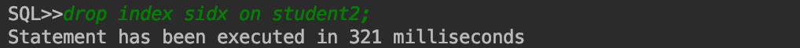

 

### 5. 选择语句

示例语句：

```sql
select * from student2;
select * from student2 where id = 1080100978;
select * from student2 where score > 20.0 and name <> 'name123';
```

- 若该语句执行成功且查询结果不为空，则按行输出查询结果，第一行为属性名，其余每一行表示一条记录；若查询结果为空，则输出信息告诉用户查询结果为空；若失败，必须告诉用户失败的原因。

  - 失败原因包含
    - 表格不存在
    - 输出的字段列表存在不存在的字段
    - 从索引中读取失败
    - 语法错误

- **执行该SQL所需的模块以及程序执行流程**

  - 执行Select语句涉及了整个系统的所有模块。
  - 解释器Interpreter获取SQL语句，解读后调取API中的`Select`方法。
  - `Select`方法调用了Catalog Manager检查数据模式以及对应的字段是否存在。
  - **对条件进行排序**，策略是：
    - 有条件涉及不等号的，给予最低的优先级
    - 条件涉及带索引的字段的，给予较高的优先级
    - 有等号的，给予较高的优先级
  - 对条件进行排序，先对带索引的等号条件进行查询，再对其他条件查询。

  * 判断记录是否符合查询条件
    * 有索引的查询下，用索引查询出来的索引指针对应的记录一一查询，将符合条件的记录的位置信息返回。
    * 无索引查询的条件下，采取一一遍历，对符合条件的记录，将其记录的位置信息返回。
  * 根据上一步收集到的符合条件的位置信息的记录取出，按照要求打印。

- 运行结果截图

  * 字符串误用全角的引号`‘`，能够识别并报错。

    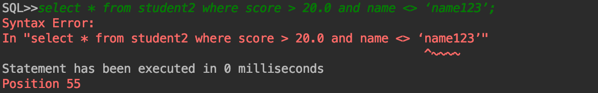

  * 修改后获得了正确的查询

    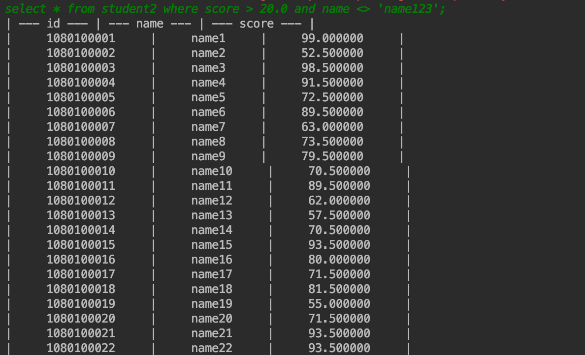

    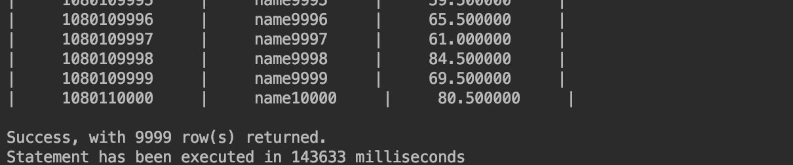

    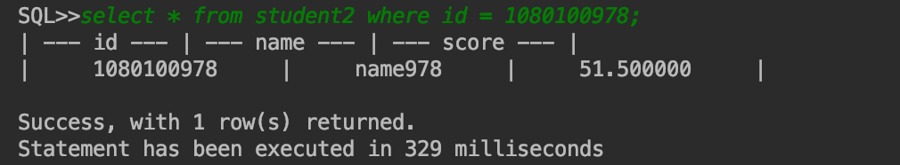

  * 索引的有效性验证

    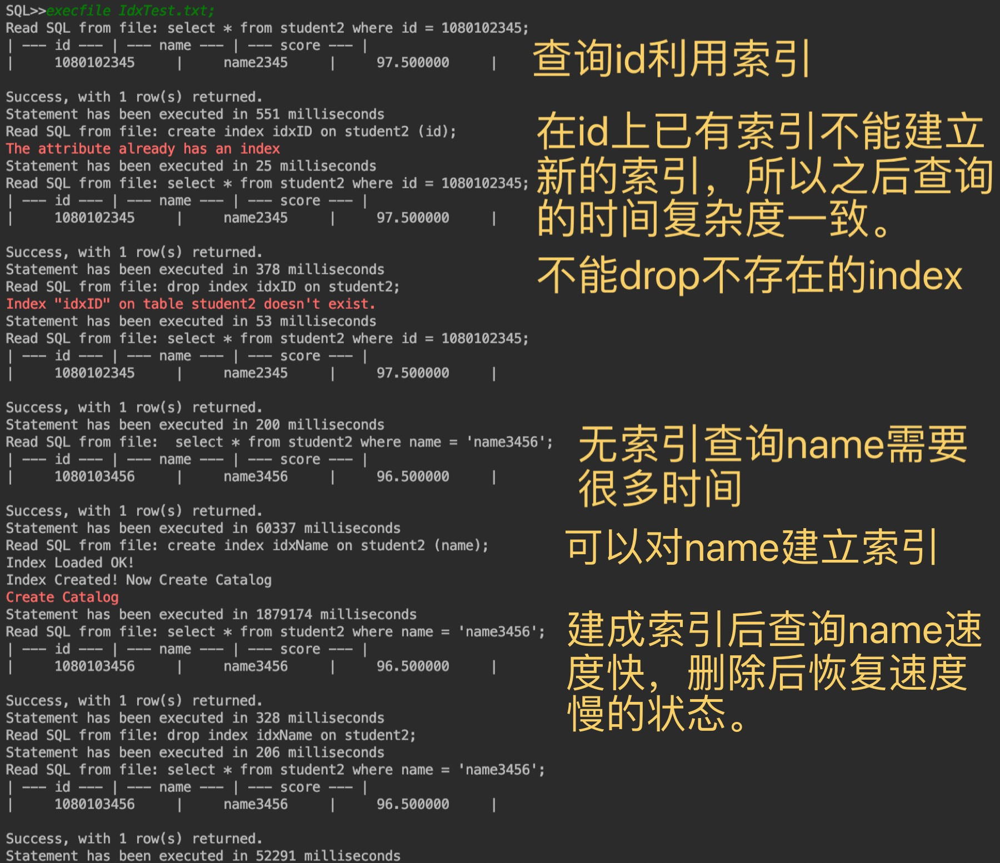

    

### 6. 插入记录语句

示例语句：

```sql
insert into student2 values (1008612315,’name999’,59.9);
```

- 针对该类语句，解析、语法检查和执行都部署完毕

  - 提示包括但不限于下述的例子。

  - 如果出现不存在数据模式名称，则不允许继续执行，并返回错误信息。

    > <div style='color:red'>Table [tblName] doesn't exist.</div>

  - 如果有主键、Unique键上存在重复的记录，则不允许继续执行，并返回错误信息。

    > <div style='color:red'>Duplicate Keys</div>

  - 如果执行成功，则返回执行的时间信息。

- **执行该SQL所需的模块以及程序执行流程**

  - 该命令涉及系统的所有模块。
  - 解释器Interpreter获取SQL语句，解读后调取API中的`InsertAll`方法。
  - `InsertAll`方法调用了Catalog Manager检查数据模式以及对应的字段是否存在。
  - 检查成功后，获取对应的数据信息模式`Catalog`对象。
  - 检查是否有主键、Unique键上存在重复的记录(`CheckDuplicateKey`)
  - 使用Record Manager插入数据
    - 定位插入数据的块和偏移量
    - 按照Catalog规定的字段顺序添加记录信息
  - 插入成功后进行成功反馈并返回`true`.

- 运行结果截图

  - 该系统insert record的效率比较好，插入10000条数据大概需要10s。
  - 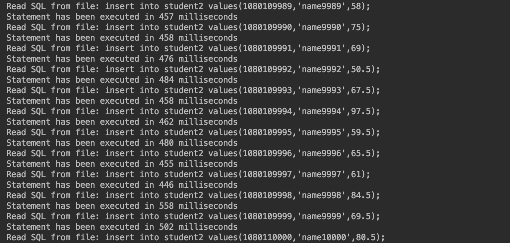
  - 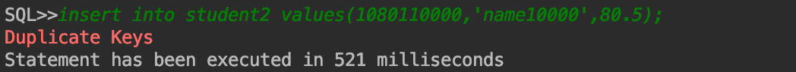

 

### 7. 删除记录语句

示例语句：

```sql
delete from student2 where id = 1080100978;
delete from student2;
```

- delete语句和Select语句具有高度的相似性，除了屏幕输出有差异，再是Delete涉及了记录的修改。其用户反馈信息不进行赘述。

- **分析执行该SQL所需的模块以及程序执行流程**

  - 执行DELETE语句涉及了整个系统的所有模块。
  - 解释器Interpreter获取SQL语句，解读后调取API中的`Delete`方法。
  - `Delete`方法调用了Catalog Manager检查数据模式以及对应的字段是否存在。
  - **对条件进行排序**，策略是：
    - 有条件涉及不等号的，给予最低的优先级
    - 条件涉及带索引的字段的，给予较高的优先级
    - 有等号的，给予较高的优先级
  - 对条件进行排序，先对带索引的等号条件进行查询，再对其他条件查询。

  - 判断记录是否存在查询条件
    - 有索引的查询下，用索引查询出来的索引指针对应的记录一一查询，将符合条件的记录的位置信息返回。
    - 无索引查询的条件下，采取一一遍历，对符合条件的记录，将其记录的位置信息返回。
  - 根据上一步收集到的符合条件的位置信息的记录取出，并将对应的位置的记录标记为已删除。详见DB Files的说明。
  - 把删除的位置的信息保存到`Records`维护的列表中。
  - 返回。

- 运行结果截图

  - 删除数据后无法再读得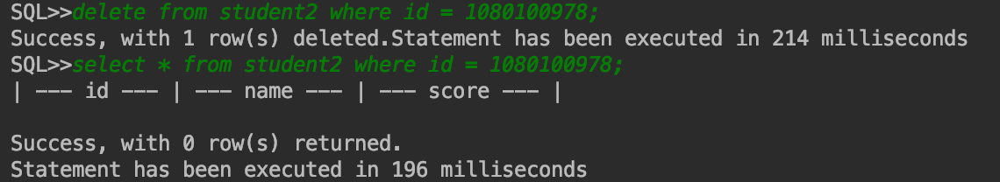

  - 删除全部数据

    

 

### 8. 退出MiniSQL系统语句

该语句的语法如下：

```sql
exit;
```

 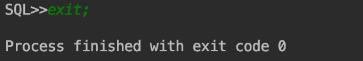

* 本系统支持数据持久化。即退出后重新登录以后，数据不丢失。


### 9. 执行SQL脚本文件语句

该语句的语法如下：

```sql
execfile file_name;
```

SQL脚本文件中可以包含任意多条上述8种SQL语句，MiniSQL系统读入该文件，然后按序依次逐条执行脚本中的SQL语句。

* 该模块只需要依赖Interpreter。

- 如果文件不存在，或者格式错误，会给予用户反馈。

- **执行该命令所需的模块以及程序执行流程**

  - 通过调用ios的方法，读取文件，并将SQL语句交由Interpreter。
  - 执行语句。

- 运行结果截图

  * 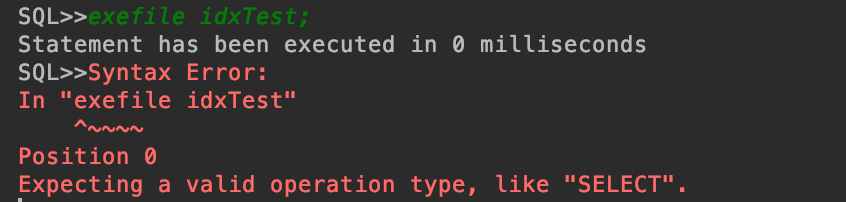

  * 从文件系统中读取内容如下的文件

    ```sql
    select * from student2 where id = 1080102345;
    create index idxID on student2 (id);
    select * from student2 where id = 1080102345;
    drop index idxID on student2;
    select * from student2 where id = 1080102345;
    
    select * from student2 where name = 'name3456';
    create index idxName on student2 (name);
    select * from student2 where name = 'name3456';
    drop index idxName on student2;
    select * from student2 where name = 'name3456';
    ```

    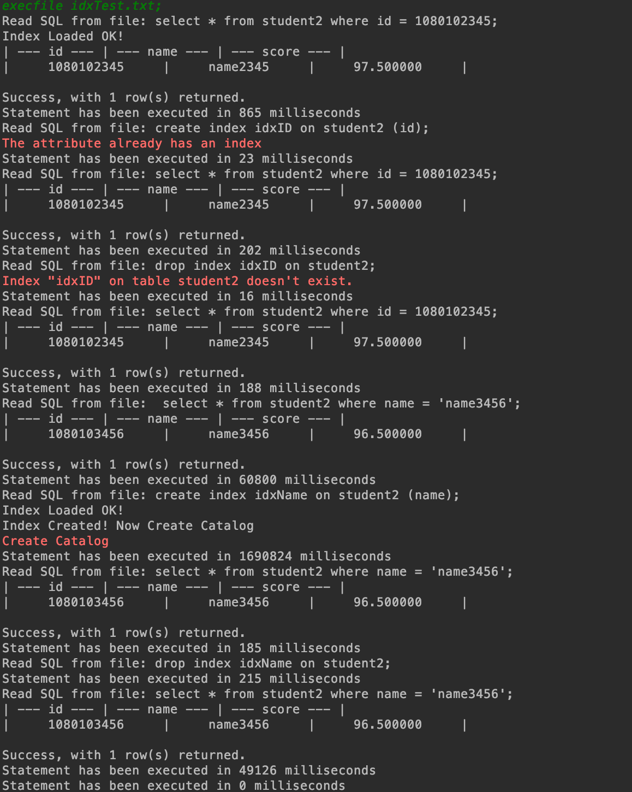

